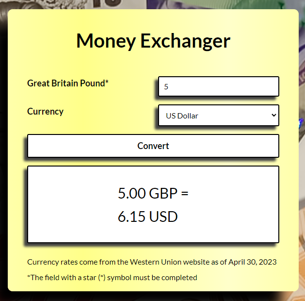

# **Money Exchanger**

## *My first converter*


### Description

This is my first tool for currency conversion. I created it as part of the "Frontend developer from scratch" course. Below is a demo of the project. The converter is still being improved.

### Screen shot



### My first page contains:


- HTML
- CSS
- JS
- BEM convention
- Flex

My logo:


If you want to learn more and test the functionality of my converter, click below:

👇

[Money Exchanger](https://robfyd.github.io/Money-Exchanger/)


```javascript
let x = "love coding";
console.log(x);
```
